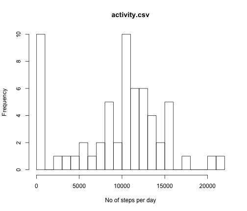
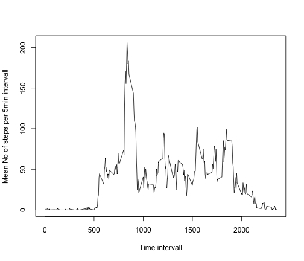
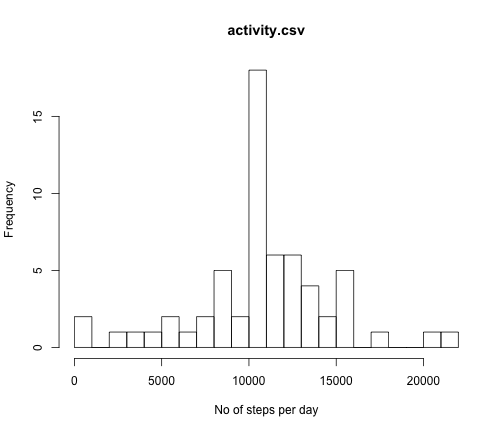
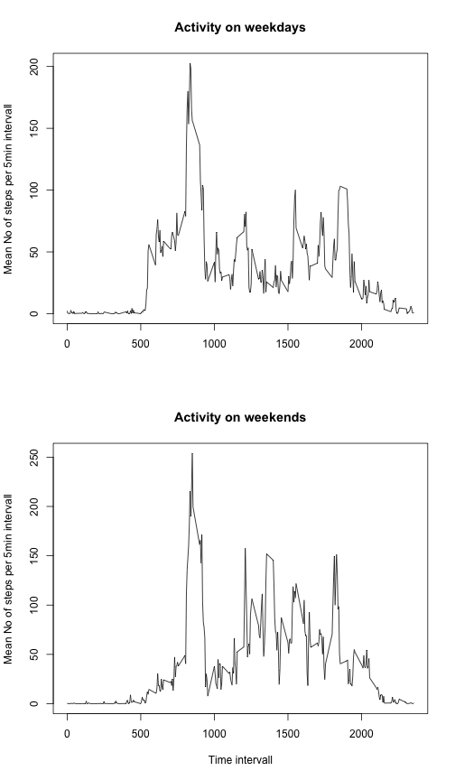

## Loading and preprocessing the data

```r
library(data.table)
fname <- "activity.csv"
if(!exists("ACT")){
  cat("loading ",fname," from ",getwd(),sep = ' ')
  tmp <- read.csv(fname,header=T,na.strings='NA')
  ACT <- data.table(tmp)
  options(scipen = 5)
}
```
## What is mean total number of steps taken per day?

```r
  sum_steps <- ACT[,sum(steps,na.rm=T),by=date]
  setnames(sum_steps,"V1","daily_steps")
  hist(sum_steps$daily_steps,breaks=25,xlab = "No of steps per day",main="activity.csv")
```

 

```r
  ACT_mean_steps <- mean(sum_steps$daily_steps)               
  ACT_median_steps <- median(sum_steps$daily_steps)  
```
The mean number of steps per day is 9354.2295082  
The median number of steps per day is 10395
Both mesures are calculated by ignoring missing values for the 5 min intervals. Specifically, the ten days with zero steps are days for which data is missing completely. 

## What is the average daily activity pattern?

```r
  ACT_mean_steps_per_interval <- ACT[,mean(steps,na.rm=T),by=interval]
  plot(ACT_mean_steps_per_interval,type="l",xlab = "Time intervall",ylab = "Mean No of steps per 5min intervall")
```

 

```r
Max_steps_interval <- ACT_mean_steps_per_interval[order(-V1)]
```

The maximum activity, on average 206.1698113 steps, is recorded in the 5min interval starting at 835.


## Imputing missing values

### 1) Number of missing values

The total number of intervals with missing values is 2304.

### 2) and 3) Correct original data for missing values 

Make a copy of the original data.table, which will become the corrected one. Find missing values in the copy and replace them with the average of the respective interval over all days.  


```r
ACT_corr <- copy(ACT)
cnt <- 1
for (i in unique(ACT_corr$interval)){
  ii <- ACT_corr[,is.na(steps) & interval==i]
  ACT_corr$steps[ii] <- round(ACT_mean_steps_per_interval$V1[cnt])
  cnt <- cnt+1
}
```

### 4) Historgram, mean, and median 

Sum up all steps per day and draw a histogram. 


```r
  sum_steps2 <- ACT_corr[,sum(steps,na.rm=T),by=date]
  setnames(sum_steps2,"V1","daily_steps")
  hist(sum_steps2$daily_steps,breaks=25,xlab = "No of steps per day",main="activity.csv")
```

 

```r
  ACT_corr_mean_steps <- mean(sum_steps2$daily_steps)               
  ACT_corr_median_steps <- median(sum_steps2$daily_steps)  
```
The mean number of steps per day is 1.0765639 &times; 10<sup>4</sup> (9354.2295082).  
The median number of steps per day is 1.0762 &times; 10<sup>4</sup> (10395).
The values in parenthesis present the uncorrected number, i.e. differences are considerable between the two means. 

## Are there differences in activity patterns between weekdays and weekends?

```r
date <- as.POSIXlt(ACT_corr$date,format="%Y-%m-%d")
we_ii <- ( (date$wday==5) | (date$wday==6))
wd_ii <-  (date$wday<5) 
ACT_corr[, day_end := ""]
```

```
##        steps       date interval day_end
##     1:     2 2012-10-01        0        
##     2:     0 2012-10-01        5        
##     3:     0 2012-10-01       10        
##     4:     0 2012-10-01       15        
##     5:     0 2012-10-01       20        
##    ---                                  
## 17564:     5 2012-11-30     2335        
## 17565:     3 2012-11-30     2340        
## 17566:     1 2012-11-30     2345        
## 17567:     0 2012-11-30     2350        
## 17568:     1 2012-11-30     2355
```

```r
ACT_corr$day_end[we_ii]<- "weekend"
ACT_corr$day_end[wd_ii]<- "weekday"
ACT_corr <- transform(ACT_corr, day_end = factor(day_end))

end_data <- subset(ACT_corr, day_end == "weekend")
day_data <- subset(ACT_corr, day_end == "weekday")

end_steps <- end_data[,mean(steps),by= interval]
day_steps <- day_data[,mean(steps),by= interval]

par(mfrow=c(2,1))
plot(day_steps,type="l",xlab = "",ylab = "Mean No of steps per 5min intervall",main="Activity on weekdays")
plot(end_steps,type="l",xlab = "Time intervall",ylab = "Mean No of steps per 5min intervall",main="Activity on weekends")
```

 


According to the above plots, there are differences in the average activity patterns on weekdays and weekands. Most strikingly, the morning increase in activity is much more abrupt on weekdays than on weekends.  
